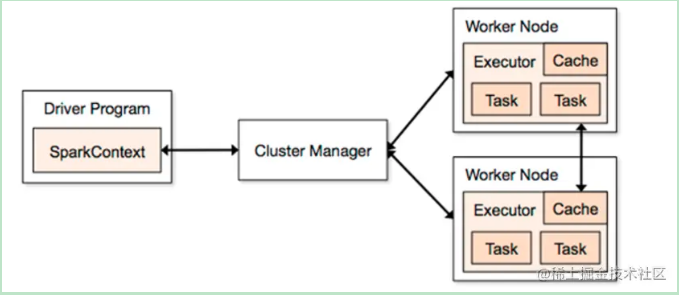

Driver
它会执行客户端写好的main方法，它会构建一个名叫 SparkContext 对象。该对象 是
所有spark程序的执行入口

Cluster Manager
给 Spark 程序提供外部计算资源的服务，一般来说有以下3种
standAlone：Spark 自带的集群模式，整个任务的资源分配由 Spark 集群的老大 master 负责
Yarn：可以把 Spark 提交到 Yarn 中运行，此时资源分配由 Yarn 中的老大 ResourceManager 负责
mesos：Apache开源的一个类似于 Yarn 的资源调度平台
正常来说我们都会使用 Yarn 去进行管理

Worker Node
Master是整个spark集群的老大，负责任务资源的分配。也就是 Spark 集群中负责干活的小弟，是负责任务计算的节点

Executor
Executor 是一个进程，它会在worker节点启动该进程（计算资源）

Task
spark任务是以task线程的方式运行在worker节点对应的executor进程中

